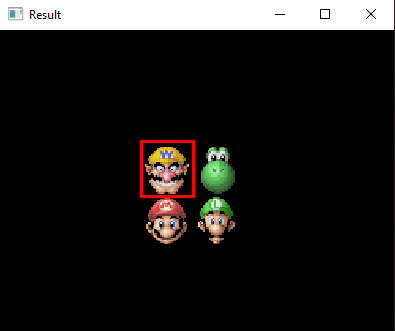

# AutoWantedMiniGame

A project were I try to automate the play of the Wanted mini game from Super Mario 64 DS.

## Presentation of the mini game

In the Nintendo DS version of Super Mario 64, we can find the _Wanted_ mini game.  
The goal is pretty simple. A face appears in the upper screen, and you have to find this face in the lower screen before the timer goes to zero.  
The first level is quite easy :  
  

But it goes quickly harder : (level 7)  
  

And even more complicated, some levels are animated, the faces are moving around the lower screen.

(I own the console and the game in real life)

## Advancements

For the moment i try to use the `opencv-python` module to make image match.

Here where I am for now.

**For the level 1 just above**  
I'm able to have a pretty decent input :

 

As well as a great image matching : 

And even to find the good face in the lower screen : 

Those results are given by the [image.py](image.py) file.

But yes, it is easier when we have to find Wario or Mario, the only ones with yellow or red. It doesn't really work with Yoshi or Luigi ...

#### What am I currently trying to do ?

1. I take a screenshot of the upperscreen.
2. I match it with the 4 faces to determine who is it.
3. I look for the wanted face in the lower screen, if found, I draw a square around the face.